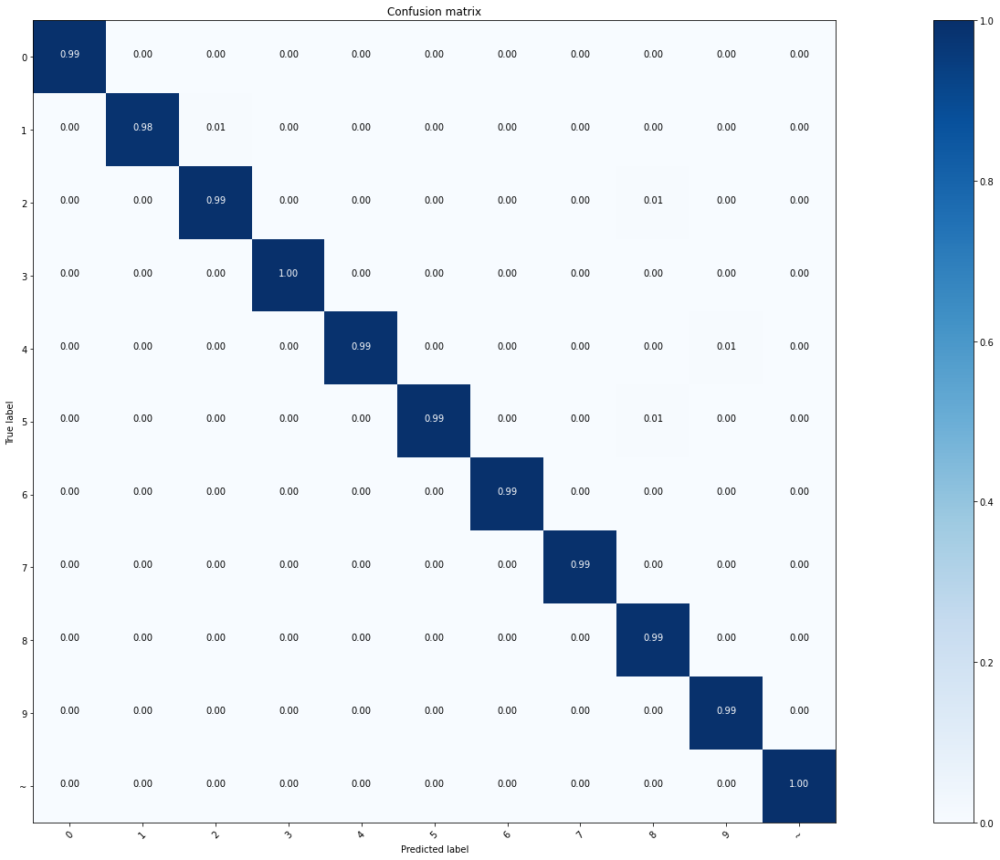

**One character recognition algorithm ⇒ Expected Execution: Google Colab Notebook**

### How to execute:
1. Download the Train and Test files of EMNIST dataset using the following links:
   
**Digits Dataset:**

From Kaggle, need to log in to download the dataset files, you can  download only the desired file instead of downloading the whole dataset files:

- Train Data: https://www.kaggle.com/datasets/crawford/emnist?select=emnist-digits-train.csv
- Test Data: https://www.kaggle.com/datasets/crawford/emnist?select=emnist-digits-test.csv
  
**Letters Dataset:**
- Train Data: https://www.kaggle.com/datasets/crawford/emnist?select=emnist-letters-train.csv
- Test Data: https://www.kaggle.com/datasets/crawford/emnist?select=emnist-letters-test.csv

  
2. Keep the same Files/Directory Structure.
3. To Execute Digits Recognition run the file named: [wandb_ai]_Digits_Recognition_EMNIST.ipynb
4. To Execute Letters Recognition run the file named: [wandb_ai]_Letters_Recognition_EMNIST.ipynb 
5. To Execute Letters Recognition run the file named: [wandb_ai]_Digits&Letters_Recognition_EMNIST.ipynb
### Requirements
- Accuracy >90%+  - Done
1. First training  - Done
    - EMNIST
    - data augmentation
    - save model
2. Displaying results of confusion matrix and global accuracy - Done
    1. On test set with all characters
    2. On test set with letters only
    3. On test set with digits only
3. Fine tuning (TO DO) - Done
    - with our database (we should be able to redo this part to enhance the OCR while we will collect data in the next months)
        - Preprocessing
        - Training /fine-tuning
    - save model

### Digits Recognition Validation Accuracy (Fine Tuned Model Saved):
- Achieved Accuracy: 99.34%
- Achieved Loss: 0.0369
- Saved Model and Trained Parameters Directory: EMNIST_Digits_Training/

### Letters Recognition Validation Accuracy (Fine Tuned Model Saved):
- Achieved Accuracy: 95.98%
- Achieved Loss: 0.1487
- Saved Model and Trained Parameters Directory: EMNIST_Letters_Training

### Digits and Letters combinedation Recognition Validation Accuracy (Fine Tuned Model Saved):
- Achieved Accuracy: 92.22%
- Achieved Loss: 0.2280
- Saved Model and Trained Parameters Directory: EMNIST_Digits&Letters_Training

